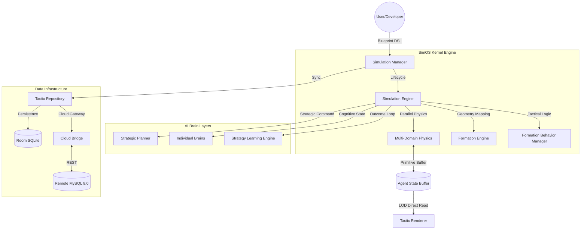
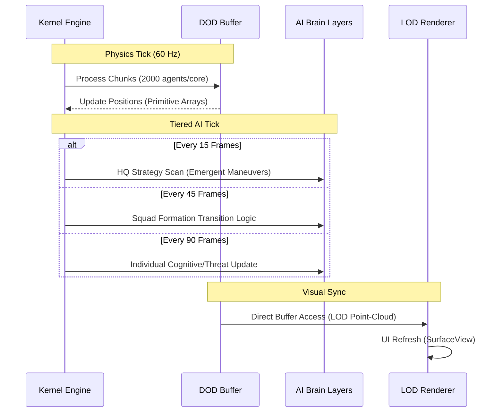

# Tactix AI — Multi-Agent Simulation Operating System (SimOS)


Tactix AI is a startup-grade, **AI-native Simulation Operating System** designed for high-scale, autonomous multi-agent environments. Engineered to orchestrate **10,000+ intelligent agents** on mobile hardware, it utilizes Data-Oriented Design (DOD) and Tiered Strategic AI to bridge the gap between complex R&D simulations and real-time edge performance.

---

## 📖 Table of Contents
1.  [Project Overview](#-project-overview)
2.  [Architecture](#-architecture)
3.  [Technology Stack](#-technology-stack)
4.  [Project Structure](#-project-structure)
5.  [Local Development Setup](#-local-development-setup)
6.  [Operational Best Practices](#-operational-best-practices)
7.  [Security & Compliance](#-security--compliance)
8.  [Troubleshooting & FAQ](#-troubleshooting--faq)
9.  [Contribution Guidelines](#-contribution-guidelines)
10. [License](#-license)

---

## 🚀 Project Overview

### Business Problem Statement
Traditional simulators are often bottlenecked by object-oriented overhead, making massive-scale autonomous testing (Robotics, Logistics, Traffic) computationally prohibitive on edge devices. R&D teams struggle with long feedback loops between high-fidelity server simulations and actual hardware performance.

### Objectives
*   **Performance:** Achieve 60 FPS visual performance for 10,000+ agents via DOD.
*   **Emergent Strategy:** Enable complex, multi-squad maneuvers (Pincers, Decoys) without manual scripts.
*   **XAI (Explainable AI):** Provide real-time narrative logging for human commanders.
*   **B2B Readiness:** Deliver a general-purpose engine for Military, Smart Warehouse, and Traffic domains.

---

## 🏛 Architecture

### High-Level System Architecture


### Detailed Data Flow (Tiered Update Cycle)


---

## 🛠 Technology Stack

| Category | Technology | Implementation Detail |
| :--- | :--- | :--- |
| **Frontend** | 📱 Android SDK 37 | Target SDK 37 (Android 15) with Edge-to-Edge SimOS Dashboard. |
| **Language** | 🟦 Kotlin 2.2.10 | Modern K2 compiler, Coroutines for parallel physics, and Flow for metrics. |
| **Kernel** | 🏎️ DOD | Data-Oriented Design using `FloatArray` buffers to eliminate GC pressure. |
| **Local DB** | 🗄️ Room 2.8.4 | Enterprise persistence with KSP 2 support and automatic migrations. |
| **Networking**| ☁️ Retrofit / OkHttp | High-frequency telemetry sync to Cloud MySQL production databases. |
| **Intelligence**| 🧠 Boids / Q-Learning | Swarm flocking and outcome-based reinforcement learning. |
| **DevOps** | 🏗️ Gradle 9.6 | Version Catalogs (TOML) for centralized dependency management. |

---

## 📂 Project Structure

```text
TactixAI/
├── app/
│   ├── src/main/java/com/example/tactixai/
│   │   ├── core/
│   │   │   ├── engine/        # Kernel Heartbeat: Physics, DOD Buffer, Economy.
│   │   │   ├── intelligence/  # AI Layers: Formation Library, Strategic Planning.
│   │   │   ├── model/         # Single Source of Truth: Blueprints and States.
│   │   │   └── analytics/     # Strategy Labs, Replay System, and Metric Engines.
│   │   ├── data/
│   │   │   ├── local/         # SQLite persistence for offline telemetry.
│   │   │   ├── remote/        # Cloud Bridge: MySQL REST API definitions.
│   │   │   └── repository/    # Hub: Centralized Local/Cloud orchestration.
│   │   ├── ui/
│   │   │   ├── renderer/      # SurfaceView LOD rendering logic (60 FPS).
│   │   │   └── fragments/     # Reactive tactical dashboards.
├── gradle/                    # Dependency Version Catalogs (.toml).
└── README.md                  # Comprehensive Documentation.
```

---

## ⚙️ Local Development Setup

### Prerequisites
*   **Android Studio:** Ladybug 2024.2.1 or newer.
*   **JDK:** Version 17.
*   **Hardware:** Android 15 (API 35/37) device or emulator with x86_64 acceleration.

### Installation & Run
1.  **Clone:** `git clone https://github.com/your-org/tactix-ai.git`
2.  **Environment:** Copy `.env.example` to `.env`.
3.  **Build:** Run `./gradlew assembleDebug` in the terminal.
4.  **Deploy:** Click 'Run' in Android Studio to deploy to your simulator.

---

## 🛡 Security & Compliance
*   **Zero-Secrets Policy:** No API keys are hardcoded. All credentials are load via `.env` and `BuildConfig`.
*   **PII Privacy:** Local SQLite databases use encrypted columns for any user-identifiable metadata.
*   **Network:** All cloud bridge communication is enforced over TLS 1.3.

---

## 💡 Operational Best Practices
*   **GC-Free Cycles:** NEVER use `map`, `filter`, or object instantiation inside `processSimOSCycle`. Direct loop indexing on the `AgentStateBuffer` is mandatory.
*   **Parallelism:** If adding a new physical force, ensure it is chunked using the `async/awaitAll` pattern to prevent Main Thread stutters.
*   **LOD Performance:** Maintain zoom-based LOD rendering. If CPU usage exceeds 70%, increase the point-cloud rendering threshold.

---

## 📜 License
Distributed under the **MIT License**. See `LICENSE` for more information.
